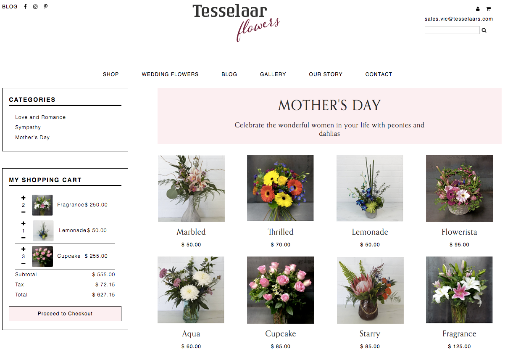

# FlowerShop
A redesign of a flower shop inspired by www.tesselaarflowers.com.au. The project is a single-page website that allows users to add and delete flowers in their shopping cart, and see the price fluctuate. The webpage is built from HTML5, CSS3, JavaScript and jQuery.

Here's a screenshot:

